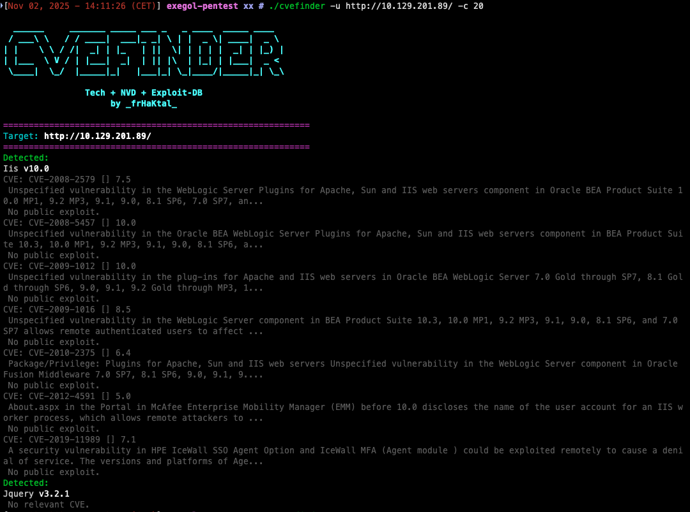

# cvefinder



Go tool to detect technologies via httpx, search CVEs on NVD, exploits on Exploit-DB.
## Usage

```bash
go build -o cvefinder cvefinder.go
./cvefinder -u https://example.com
# or -f urls.txt -c 20
# or echo "https://example.com" | cvefinder
